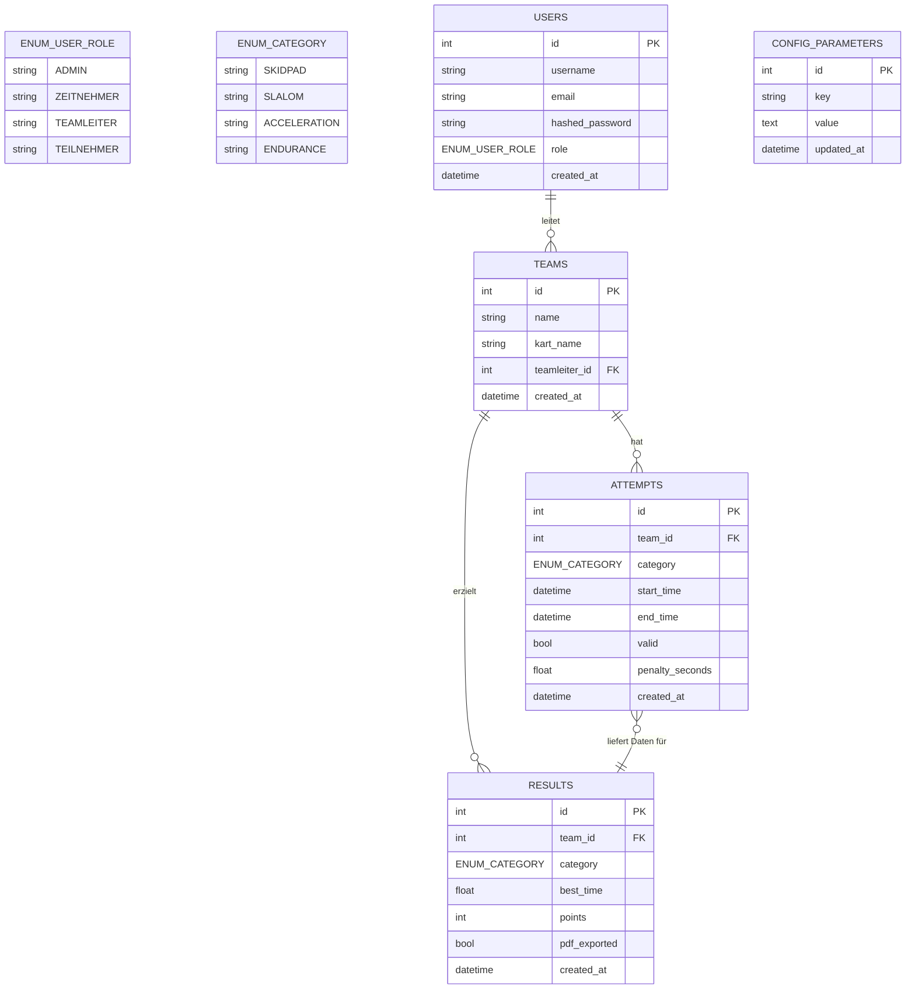

```mermaid
erDiagram
    ENUM_USER_ROLE {
        string ADMIN
        string ZEITNEHMER
        string TEAMLEITER
        string TEILNEHMER
    }

    ENUM_CATEGORY {
        string SKIDPAD
        string SLALOM
        string ACCELERATION
        string ENDURANCE
    }

    USERS {
        int id PK
        string username
        string email
        string hashed_password
        ENUM_USER_ROLE role
        datetime created_at
    }

    TEAMS {
        int id PK
        string name
        string kart_name
        int teamleiter_id FK
        datetime created_at
    }

    ATTEMPTS {
        int id PK
        int team_id FK
        ENUM_CATEGORY category
        datetime start_time
        datetime end_time
        bool valid
        float penalty_seconds
        datetime created_at
    }

    RESULTS {
        int id PK
        int team_id FK
        ENUM_CATEGORY category
        float best_time
        int points
        bool pdf_exported
        datetime created_at
    }

    CONFIG_PARAMETERS {
        int id PK
        string key
        text value
        datetime updated_at
    }

    USERS ||--o{ TEAMS : "leitet"
    TEAMS ||--o{ ATTEMPTS : "hat"
    TEAMS ||--o{ RESULTS : "erzielt"
    ATTEMPTS }o--|| RESULTS : "liefert Daten für"


```