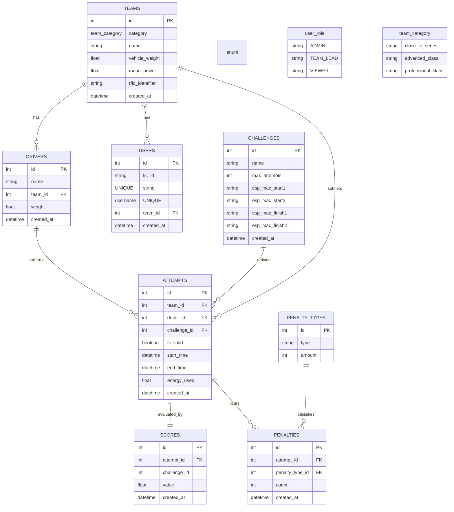

```mermaid
erDiagram
    USERS {
        int id PK
        string kc_id UNIQUE
        string username UNIQUE
        int team_id FK
        datetime created_at
    }

    TEAMS {
        int id PK
        team_category category
        string name
        float vehicle_weight
        float mean_power
        string rfid_identifier
        datetime created_at
    }

    DRIVERS {
        int id PK
        string name
        int team_id FK
        float weight
        datetime created_at
    }

    CHALLENGES {
        int id PK
        string name
        int max_attempts
        string esp_mac_start1
        string esp_mac_start2
        string esp_mac_finish1
        string esp_mac_finish2
        datetime created_at
    }

    ATTEMPTS {
        int id PK
        int team_id FK
        int driver_id FK
        int challenge_id FK
        boolean is_valid
        datetime start_time
        datetime end_time
        float energy_used
        datetime created_at
    }

    SCORES {
        int id PK
        int attempt_id FK
        int challenge_id
        float value
        datetime created_at
    }

    PENALTY_TYPES {
        int id PK
        string type
        int amount
    }

    PENALTIES {
        int id PK
        int attempt_id FK
        int penalty_type_id FK
        int count
        datetime created_at
    }

    TEAMS ||--o{ DRIVERS : "has"
    TEAMS ||--o{ USERS : "has"
    TEAMS ||--o{ ATTEMPTS : "submits"
    DRIVERS ||--o{ ATTEMPTS : "performs"
    CHALLENGES ||--o{ ATTEMPTS : "defines"
    ATTEMPTS ||--|| SCORES : "evaluated_by"
    PENALTY_TYPES ||--o{ PENALTIES : "classifies"
    ATTEMPTS ||--o{ PENALTIES : "incurs"

    enum user_role {
        string ADMIN
        string TEAM_LEAD
        string VIEWER
    }

    enum team_category {
        string close_to_series
        string advanced_class
        string professional_class
    }
```
