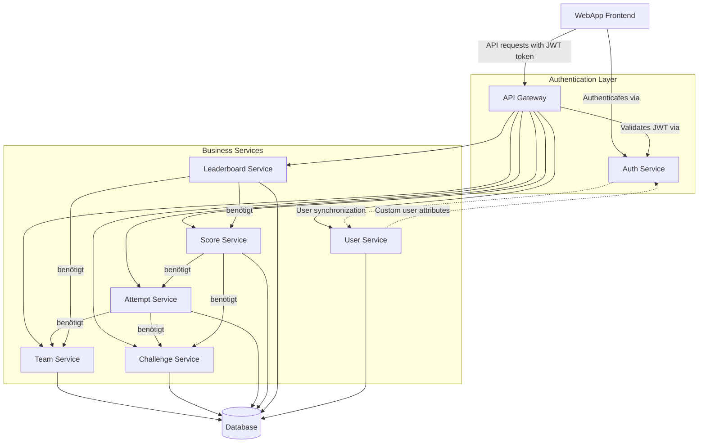

```mermaid
flowchart TD
    A[WebApp Frontend] -->|Authenticates via| K[Auth Service]
    
    A -->|API requests with JWT token| B[API Gateway]
    
    B -->|Validates JWT via| K
    
    B --> C1[Team Service]
    B --> C2[Challenge Service]
    B --> C3[Attempt Service]
    B --> C4[Score Service]
    B --> C5[Leaderboard Service]
    B --> C6[User Service]
    
    C1 --> D[(Database)]
    C2 --> D
    C3 --> D
    C4 --> D
    C5 --> D
    C6 --> D
    
    C3 -->|benötigt| C1
    C3 -->|benötigt| C2
    C4 -->|benötigt| C3
    C4 -->|benötigt| C2
    C5 -->|benötigt| C4
    C5 -->|benötigt| C1
    
    K -.->|User synchronization| C6
    C6 -.->|Custom user attributes| K
    
    %% Authentication flows
    subgraph "Authentication Layer"
        K
        B
    end
    
    subgraph "Business Services"
        C1
        C2
        C3
        C4
        C5
        C6
    end
```