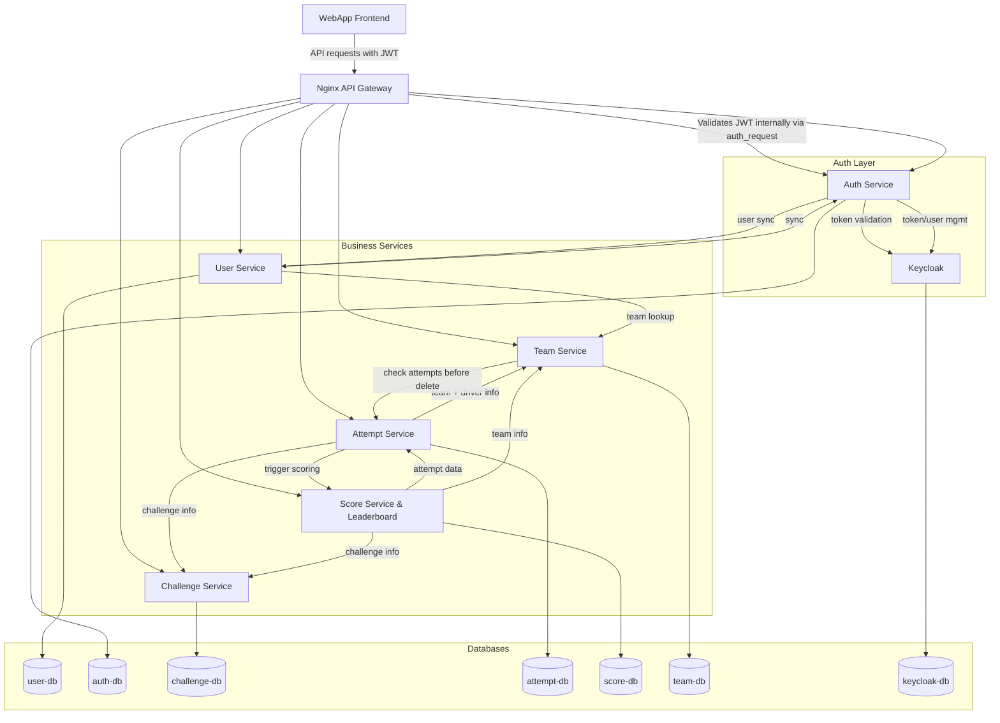

```mermaid
flowchart TD
    A[WebApp Frontend] -->|API requests with JWT| B[Nginx API Gateway]
    B -->|Validates JWT internally via auth_request| AS[Auth Service]
    AS -->|token validation| KC[Keycloak]

    B --> US[User Service]
    B --> CS[Challenge Service]
    B --> ATS[Attempt Service]
    B --> SS[Score Service & Leaderboard]
    B --> TS[Team Service]
    B --> AS

    US --> US_DB[(user-db)]
    AS --> AS_DB[(auth-db)]
    CS --> CS_DB[(challenge-db)]
    ATS --> ATS_DB[(attempt-db)]
    SS --> SS_DB[(score-db)]
    TS --> TS_DB[(team-db)]
    KC --> KC_DB[(keycloak-db)]

    %% Inter-service HTTP calls
    US -->|sync| AS
    US -->|team lookup| TS

    AS -->|user sync| US
    AS -->|token/user mgmt| KC

    ATS -->|trigger scoring| SS
    ATS -->|team + driver info| TS
    ATS -->|challenge info| CS

    SS -->|attempt data| ATS
    SS -->|team info| TS
    SS -->|challenge info| CS

    TS -->|check attempts before delete| ATS

    subgraph "Auth Layer"
        KC
        AS
    end

    subgraph "Business Services"
        US
        CS
        ATS
        SS
        TS
    end

    subgraph "Databases"
        US_DB
        AS_DB
        CS_DB
        ATS_DB
        SS_DB
        TS_DB
        KC_DB
    end
```